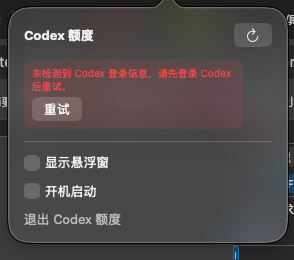

# Codex 余量小组件（CodexQuotaWidget）

一个纯本地的 macOS 菜单栏应用：复用本机 Codex 登录状态与用量能力，展示额度窗口的剩余百分比、
重置时间与最近任务的 Token 计数。应用不上传任何本地数据，只读调用 Codex 现有用量接口。

## 截图

### 菜单栏状态


### 详情面板



## 功能

- 菜单栏常驻，不显示 Dock 图标；文字直接显示当前最紧张（剩余比例最低）的额度窗口。
- 点击菜单栏图标打开详情面板：每个窗口的剩余/已用百分比、时长、重置时间、最近 Token 计数、
  最近刷新时间、手动刷新（支持 Command-R）、悬浮窗开关、开机启动开关与退出入口。
- 可选悬浮窗：默认关闭，开启后显示无焦点深色圆角卡片，位置在重启后保留。
- 开机启动：默认关闭，基于 `SMAppService.mainApp` 的真实系统状态，不用本地偏好冒充。
- 容错解析：任一额度窗口缺失、为 `null`、字段非法或出现未知窗口时长都不会导致崩溃。
- 认证兼容：优先通过 Codex 自带 `app-server` 读取额度，支持文件、macOS 钥匙串和桌面应用登录态；
  旧版 Codex 不支持该能力时自动回退到 `~/.codex/auth.json`。

## 隐私

- 不读取、不展示对话标题、正文或用户输入；本地 Token 统计只解析结构化的 Token 事件。
- 小组件不直接读取 macOS 钥匙串；优先由 Codex 自身认证层完成额度读取。回退链路中的认证凭据
  只在内存中短暂使用，不写日志、不持久化；网络请求只设置 `Authorization`、
  可选的账号标识与标准 `Accept` 头。
- 网络传输使用 `URLSession(configuration: .ephemeral)`，不写磁盘缓存、不持久化 Cookie。
- 本地持久化的用户偏好仅包含：悬浮窗开关、悬浮窗位置、开机启动状态；不包含任何凭据。

## 工程结构

```
Package.swift
Sources/CodexQuotaCore/      # 不依赖 UI 的领域逻辑（解析、认证、网络、Token 统计、刷新状态机）
  CodexAppServerClient.swift # Codex CLI 定位、app-server JSONL RPC 与超时清理
Sources/CodexQuotaWidget/    # AppKit + SwiftUI 菜单栏应用
Tests/CodexQuotaCoreTests/   # Core 单元测试
Tests/CodexQuotaWidgetTests/ # ViewModel / 菜单栏文案单元测试
Resources/Info.plist         # 打包用的 Info.plist（LSUIElement = true）
scripts/build_app.sh         # 组装 .app
scripts/package_dmg.sh       # 生成本地安装用 DMG
scripts/scan_secrets.sh      # 扫描构建产物/测试输出，确认无假 token/cookie 泄露（TC-03-04）
```

Core 层的文件、网络、时钟、开机启动能力全部通过协议注入（`FileSystemProviding`、
`HTTPTransport`、`ClockProviding`、`LoginItemControlling` 等），因此单元测试无需接触真实磁盘、
网络或系统开机启动状态。

## 构建与测试环境要求

- Apple Silicon Mac，macOS 13 及以上。
- 只需要 Swift 命令行工具（Command Line Tools），不需要完整 Xcode。
- 目标机器需安装 Codex CLI 或 Codex 桌面应用；可用 `CODEX_BINARY=/绝对路径/codex` 覆盖自动查找结果。

### 已知环境差异：`swift test` 需要额外的 C++ 头文件路径

本机安装的 Command Line Tools 中，Swift 工具链自带的 `usr/include/c++/v1`
目录只包含极少数头文件（缺少 `<atomic>` 等标准头），而 SDK 内其实有完整的 libc++ 头文件。
`swift build`（构建可执行文件/DMG）不受影响；但 `swift test` 依赖的 `swift-testing`
包中有一小段 C++ 源码，在这台机器上编译该 C++ 源码需要显式把 SDK 的 libc++ 头目录加入搜索路径，
否则会报 `'atomic' file not found`。已通过 `Package.swift` 显式声明 `swift-testing` 源码依赖
（原生工具链中的 `Testing.framework` 在此环境下缺少可自动发现的宏插件路径，无法直接
`import Testing`），解决方式是运行测试时设置以下环境变量：

```bash
export CPLUS_INCLUDE_PATH="$(xcrun --sdk macosx --show-sdk-path)/usr/include/c++/v1"
swift test --package-path .
```

如果目标机器的 Command Line Tools 是标准完整安装（多数机器如此），通常不需要这个环境变量，
`swift test` 应可直接运行；上述设置在标准环境下也是无害的（多一条头文件搜索路径）。

### 构建可执行文件

```bash
swift build --package-path .
```

### 运行单元测试

```bash
export CPLUS_INCLUDE_PATH="$(xcrun --sdk macosx --show-sdk-path)/usr/include/c++/v1"
swift test --package-path .
```

### 组装 .app 并生成 DMG

```bash
scripts/build_app.sh                 # 产出 .build/app/CodexQuotaWidget.app（ad-hoc 签名）
scripts/package_dmg.sh                # 产出 .build/dist/CodexQuotaWidget.dmg
```

`build_app.sh` 使用 `codesign --sign -` 做 ad-hoc 签名（本机无 Developer ID 证书，仅供本地运行）。
如需分发给其他机器，请替换为你自己的开发者签名身份。

### 隐私扫描（TC-03-04）

`scripts/scan_secrets.sh` 会从 `Tests/CodexQuotaCoreTests/TestSupport.swift` 与
`Tests/CodexQuotaWidgetTests/TestSupport.swift` 中自动提取测试用的假 token/cookie 字面量清单，
逐一扫描 `.build/app`、`.build/release`、`.build/arm64-apple-macosx/release` 等构建产物
（以及可选传入的测试输出日志），命中任意假值即以非 0 退出，可直接接入 CI：

```bash
scripts/build_app.sh
scripts/scan_secrets.sh

# 如需一并扫描测试输出：
CPLUS_INCLUDE_PATH="$(xcrun --sdk macosx --show-sdk-path)/usr/include/c++/v1" \
  swift test --package-path . 2>&1 | tee /tmp/codex-quota-widget-test-output.log
scripts/scan_secrets.sh /tmp/codex-quota-widget-test-output.log
```

## 手动 QA（自动化未覆盖部分）

以下验收点依赖真实 GUI 交互，未被单元测试自动覆盖，建议在正式发布前手动验证：

- TC-04-03：开启悬浮窗、拖动到新位置、关闭应用、重新启动，确认悬浮窗开关与位置均被保留，
  且点击悬浮窗关闭按钮只隐藏窗口、不退出应用。
- TC-04-05：双击生成的 DMG 安装、打开 `.app` 后确认无 Dock 图标，在详情面板中按 Command-R
  确认会触发一次刷新。

## 已知限制

- `account/rateLimits/read` 与回退使用的 `wham/usage` 都属于 Codex 内部能力，协议可能演进；
  已通过双链路回退、camelCase/snake_case 容错解析和明确错误分类降低该风险。
- 首版不支持多账号切换、Intel Mac 与 Mac App Store 分发。

## 许可证

本项目采用 [MIT License](LICENSE) 开源。
